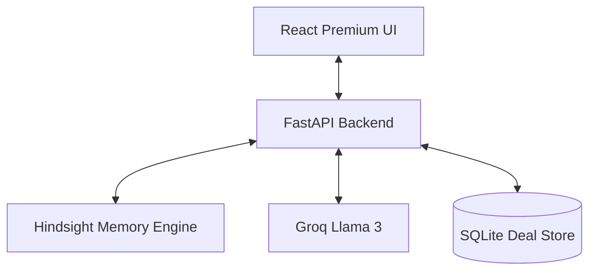

# 🧠 DealMind AI — Memory-Augmented Sales Intelligence

> **The sales intelligence agent that actually remembers. Built with a Hindsight-style local memory engine, ultra-fast Groq inference, and a premium React dashboard.**

---

## 💡 The Problem & The Vision

In enterprise sales, deals take months to close. Critical details—like a client's specific budget anxiety, a competitor's stealth move, or a casual mention of a preferred timeline—are often lost in the noise of a busy pipeline. This is the **"Memory Gap"** that leads to stalled deals and lost revenue.

**DealMind AI** is our solution. It's not just another AI chatbot; it's a memory-augmented companion that mimics human "Hindsight." By synthesizing every past interaction into a structured local memory bank, DealMind provides sales agents with instant, context-aware intelligence that gets smarter as the deal matures.

---

## ✨ Features


DealMind AI is designed for high-performance sales teams who need an agent that grows smarter with every call.

- 🧠 **Memory Engine**: Uses a local `retain`/`recall`/`reflect` architecture. It doesn't just store logs; it understands context and evolves its "Persona" over time.
- ⚡ **Seamless CRM Automation**: Automatically extracts deal stages, objections, and sentiment from chat context—updating the SQLite database without manual entry.
- 📋 **Strategic Dossiers**: Generates deep-dive strategic briefings and objection-handling playbooks based on your unique conversation history with a client.
- 📊 **Real-time Pipeline**: A premium dark-mode dashboard providing instant visibility into deal value, win probability, and memory depth.

## 🏗️ Architecture



## 🚀 Quick Start

### 1. Prerequisites
- Python 3.10+
- Node.js 18+ (for frontend development)
- A [Groq API Key](https://console.groq.com)

### 2. Backend Setup
```bash
cd backend
pip install -r requirements.txt
# Create .env and add GROQ_API_KEY
python main.py
```
The server will start at `http://localhost:8000`.

### 3. Frontend Setup (Development)
The backend automatically serves the production build. To run in development mode:
```bash
cd "DealMind AI Web App UI"
npm install
npm run dev
```

---

## 🧪 The "Wow" Demo Flow (60 Seconds)

1. **Cold Start**: Start a new chat. The indicator shows `🧊 Cold Start`. Ask: *"What do we have in the pipeline?"*
2. **Context Recall**: Select **TechNova** from the sidebar. Ask: *"What's the status here?"* The agent recalls pre-seeded memories about pricing pushback.
3. **Seamless CRM Update**: Chat: *"I just talked to Sarah from TechNova. They love the pilot but mentioned a strict $100k budget cap."*
   - Observe the **Brain Feed** bar: `Updating Deal Metadata...`
   - Refresh or check the sidebar: The "Budget Cap" objection is now automatically saved!
4. **The Dossier**: Click **View Dossier**. The agent generates a markdown brief synthesizing the new budget constraint into a negotiation strategy.
5. **Reflection**: Click **Reflect**. The agent analyzes all stored memories to find cross-deal patterns (e.g., "Competitor X is being mentioned in 40% of deals").

---

## 📂 Project Structure

```
├── backend/
│   ├── main.py            # FastAPI server (Serves static files & API)
│   ├── agent.py           # Core orchestrator (CRM automation + Memory)
│   ├── memory_service.py  # TF-IDF based Memory Engine with Temporal Decay
│   ├── llm_service.py     # Groq LLM inference pipelines
│   └── deal_manager.py    # SQLite database wrapper
├── DealMind AI Web App UI/
│   ├── src/               # React application source
│   └── dist/              # Production build (served by backend)
└── .env                   # API Keys and configuration
```

## 🛠️ Tech Stack

| Layer | Technology |
|---|---|
| **Backend** | Python / FastAPI / Pydantic |
| **LLM** | Groq (Llama 3 70B / 8B) |
| **Frontend** | React / Vite / Tailwind / Shadcn UI |
| **Logic** | Custom Hindsight-style Memory Implementation |
| **Database** | SQLite (Deals) / Local JSON (Memories) |

---

*Built for the RecallIQ Hackathon* 🚀
